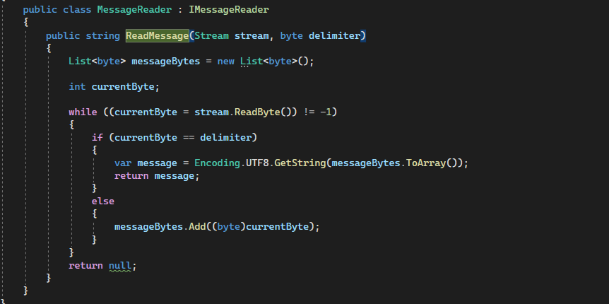

# ConsoleTagApp

# About project :
- Structuring project states (work flow) : Created a dev branch based on main and some branches based on dev, depending on what feature I added.
- Project structure : we have four projects like Domain, BusinessLogic (Bl), Infrustructure and Console app.
- Task 1 : there is a method that takes a file from user and reads sequential messages (data packets) from the input byte stream (Stream) and uses the using construct to quickly release resources.
- Task 2.1 : there is a method that allows you to select a user (with his tags) by his Id and Domain 
- Task 2.2 : there is a method that allows you to get the number of records in the database and a method that allows the user to apply pagination by selecting a page and the number of records on the page If you want to see more about pagination, filtration and sorting from me, please click here https://github.com/OlegSvekla/CrudOperations
- Task 2.3 : there is a method that allows you to select all users by tag value (who have this tag) and Domain
- Data Relationship : Many-to-many 

# Notice 1 : 

- I remember that the data cannot be disclosed, but since this is a test task, accordingly the test data, I provided this data.

# Notice 2 : 

- Don't forget to connect your application to your local database 

